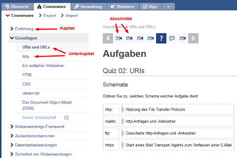
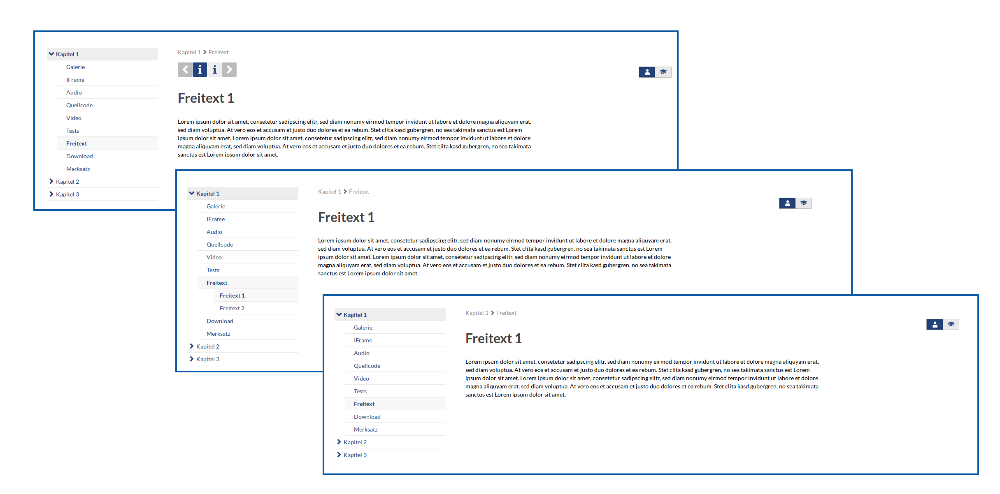

Strukturierung
==============

Kapitel, Unterkapitel, Abschnitte
---------------------------------

*Kapitel, Unterkapitel und Abschnitte*

Ein Kurs hat immer drei Gliederungsebenen: 
Kapitel und Unterkapitel werden in der Navigation auf der linken Seite untereinander dargestellt 
und Abschnitte als vertikale Navigation über dem gerade betrachteten Abschnitt.

Diese klassische Ansicht kann in den Einstellungen verändert werden. Die dritte Navigationsebene (Abschnitte)
kann auch in die Kapitelnavigation eingebunden werden. Wird die dritte Navigationsebene nicht benötigt, kann diese 
auch abgeschaltet werden.

*klassische Navigation, dritte Ebene in Kapitelnavigation, dritte Ebene deaktiviert*
