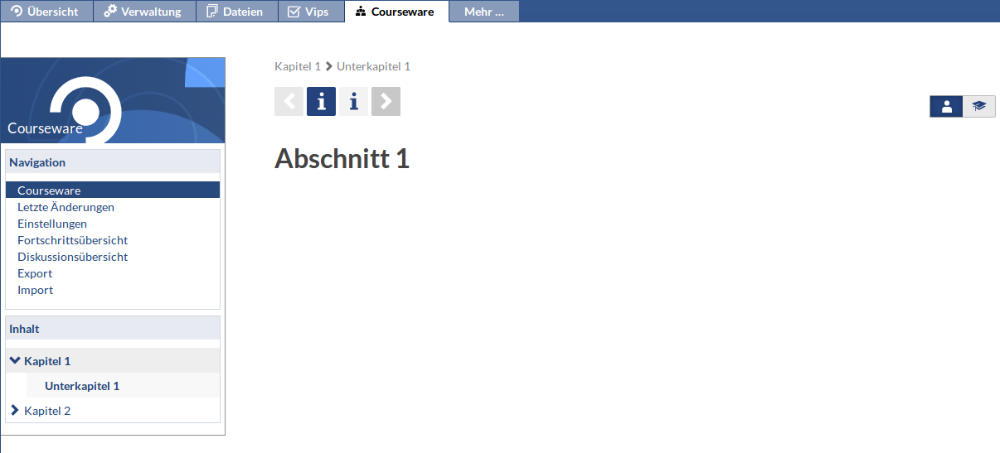
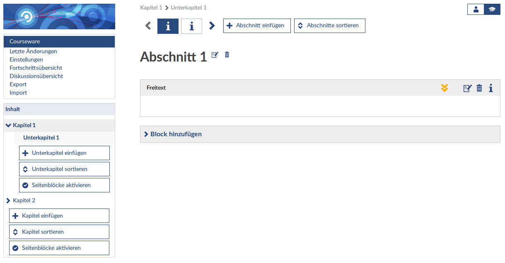
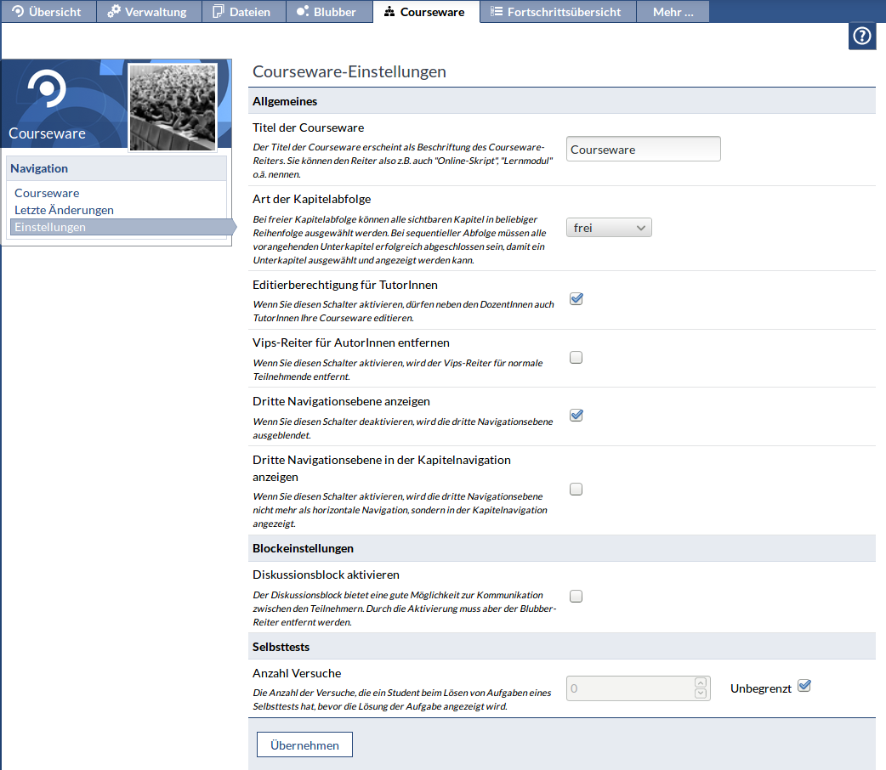
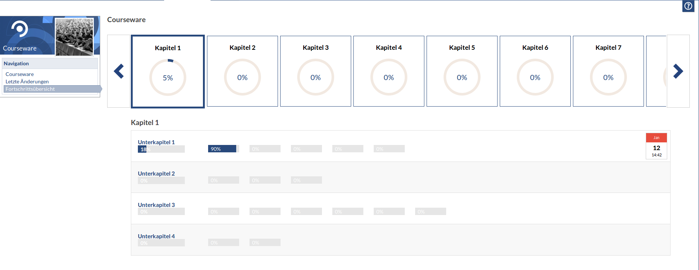
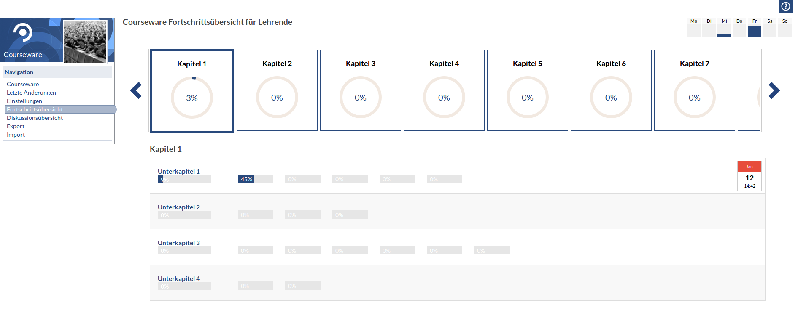

Courseware nutzen
=================

Aktivieren Sie das Inhaltselement "Courseware" in einem bereits existierenden Kurs 
und wechseln Sie in den Reiter "Courseware".

Direkt nach der Aktivierung enthält Courseware bereits die grundlegenden 
[Strunkturelemente](structure.md). Zu Beginn befindet man sich in der Studentenansicht. 
Mit einem Klick auf das Doctoral-Cap-Icon wird der Autorenmodus aktiviert. 

In der Autorenansicht können [Blöcke](blocks.md) und [Strunkturelemente](structure.md) 
hinzugefügt werden. Über den Knopf "Einstellungen" erreicht man die Seite der 
Courseware-Konfiguration. Hier sind verschiedenste Einstellungen zum Verhalten der 
Courseware möglich.

Lernende und Lehrende haben die Möglichkeit den Fortschritt in einer Übersicht zu betrachten.
Hierbei wird bei den Lernenden der individuelle Fortschritt dargestellt. Lehrende erhalten hingegen eine
Zusammenfassung der Kursteilnehmen. Der Fortschritt aller Kursteilnehmer wird aggregiert, der Lehrende 
kann nicht den Fortschritt eines einzelnen Teilnehmers einsehen.

